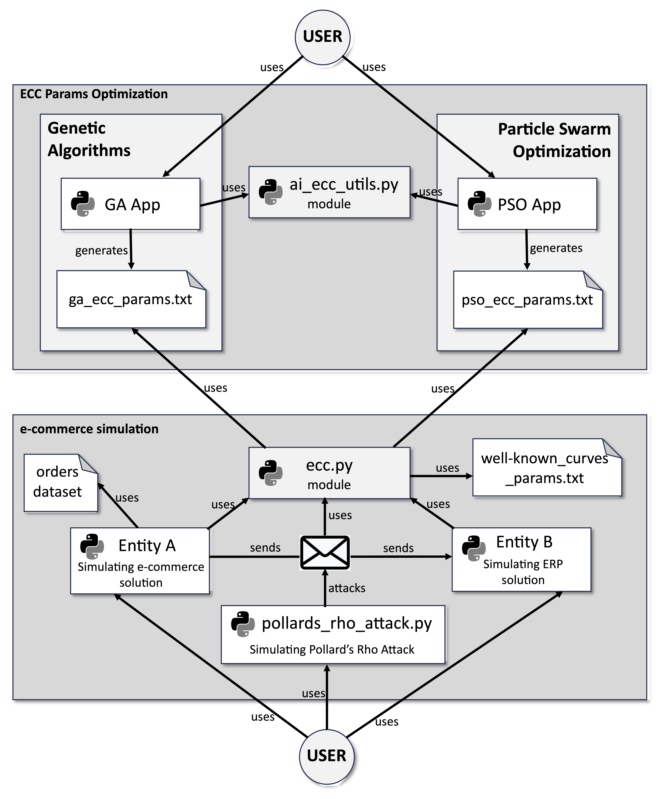

# Comparative Analysis of Genetic Algorithm (GA) and Particle Swarm Optimization (PSO) in ECC Optimization

This repository contains the code and resources for a comprehensive analysis between two vital artificial intelligence algorithms, **GA** and **PSO**, focusing on the optimization of **Elliptic Curve Cryptography (ECC)** parameters. The research emphasizes implications for enhancing cybersecurity in third-party e-commerce integrations, especially in the pre-quantum era.

## Introduction

We explore and compare the **Genetic Algorithm (GA)** and **Particle Swarm Optimization (PSO)** to optimize ECC parameters, such as the elliptic curve coefficients, prime number, generator point, group order, and cofactor. The analysis is conducted in a simulated e-commerce environment, with a strong focus on traditional computing. For detailed insights into the study's methodology and findings, please refer to the corresponding paper.

## Main Findings

- **Robust Optimization Techniques**: Incorporation of Pollard's rho attack and Hasse's theorem for optimization precision.
- **Performance Comparison**: Insights into which bio-inspired algorithm yields better optimization results.
- **Simulated E-commerce Testing**: Contrast with well-known curves like secp256k1 in the transmission of order messages using ECDH and HMAC.
- **Implications and Recommendations**: Highlighting the effectiveness of GA and PSO in ECC optimization, with recommendations for immediate consideration.

## Implementation

The implementation is divided into two main groups: **ECC Params Optimization** and **e-commerce Simulation**. Each consists of applications and software modules built using **Python**.

### A. ECC Params Optimization Group
- **Genetic Algorithm**: Implemented in `GA.py`, employing the DEAP library.
- **Particle Swarm Optimization**: Implemented in `PSO.py`.
- **ECC Parameters Files**: Contains best parameters found by GA and PSO (`ga_ecc_params.txt` and `pso_ecc_params.txt`).
- **Utility Module**: `ai_ecc_utils.py` This module assists with elliptic curve creation and validation.
    - **Generation**: Provides functions for prime numbers and generator points using mathematical tools like the Legendre symbol and Tonelli-Shanks algorithm.
    - **Validation**: Checks elliptic curve parameters for validity, including cofactor, prime p, point validity, and confirming non-singular, anomalous, or supersingular attributes.
    - **Security Evaluation**: Implements Pollard's rho attack to assess ECC parameters' security, employing various mathematical functions.
    - **Fitness Calculation**: Calculates a cumulative fitness score for candidates by evaluating elliptic curve suitability, based on factors such as Hasse's theorem bounds, attack resistance, and curve order.

### B. E-commerce Simulation Group
- **Standard Curves File**: `brainpoolP256r1.txt` and `secp256k1.txt` for standard cryptography curves.
- **ECC Utility Module**: `ecc.py` for reading and structuring ECC parameters.
- **Orders Dataset**: `Online_Retail.xlsx` Invoices converted into order data for practical simulation.
- **EntityA and EntityB**: Emulated e-commerce solution (`EntityA.py`) and simulated ERP server (`EntityB.py`) using Flask.
- **Pollard's Rho Attack**: `pollards_rho_attack.py` to attack communication between entities and evaluate ECC parameters.

## Project Structure

The repository is organized as follows:
```
project-root/
├── README.md
├── LICENSE.md
├── ecc_optimization/
│ ├── GA.py
│ ├── PSO.py
│ └── ai_ecc_utils.py
├── ecc_parameters/
│ ├── ga_ecc_params.txt
│ ├── pso_ecc_params.txt
│ ├── brainpoolP256r1.txt
│ └── secp256k1.txt
├── e-commerce_simulation/
│ ├── entityA.py
│ ├── entityB.py
│ ├── ecc.py
│ └── pollard_rho_attack.py
├── data/
│ └── Online_Retail.xlsx
├── requirements.txt
└── assets/
    └── environment_architecture.png
```
## Requirements

Before running the code, you must install several Python packages that are used throughout the various scripts. Below is a description of the key packages:

- **sympy**: For prime number checking.
- **tinyec**: A library for elliptic curve cryptography.
- **pycryptodome**: Cryptographic library offering various crypto algorithms.
- **requests**: For making HTTP requests.
- **pandas**: For data manipulation and analysis.
- **matplotlib**: For plotting and visualization.
- **gmpy2**: Provides arithmetic and mathematical functions.
- **scikit-learn**: For various machine learning tasks.
- **numpy**: For numerical operations.

You can install these packages using the following command:

```bash
pip install sympy tinyec pycryptodome requests pandas matplotlib gmpy2 scikit-learn numpy
```

Make sure that you have Python and pip installed on your system before running the command.

## How to Run

Follow the steps below to execute the simulation:

1. **Optimize ECC Parameters**:
   - Run `ga.py` to generate the optimized parameters using Genetic Algorithm and save them to `ga_ecc_params.txt`.
   - Run `pso.py` to generate the optimized parameters using Particle Swarm Optimization and save them to `pso_ecc_params.txt`.

2. **Generated Folders**:
    After the execution of `ga.py` and `pso.py`, two folders will be created in the local environment: `fitness_progression` and `logs`.
    - `fitness_progression`: It contains the graphical representation of the fitness progression over generations.
    - `logs`: It contains the log files of the optimization processes. 
    
    **Note**:
   Both `fitness_progression` and `logs` folders are added to `.gitignore`, so they will not be tracked by version control, and you may find them only in your local environment after running the scripts.
   
4. **Execute ERP Emulated Solution**:
   - Run `EntityB.py` to start the emulated ERP solution. You'll be prompted to choose the type of ECC parameters to use (e.g., GA, PSO, or well-known curves).

5. **Run E-commerce Solution**:
   - Execute `EntityA.py` to send the dataset of the orders, utilizing the ECC parameters selected in the previous step, only if `EntityB.py` is running, otherwise, it won't work.

6. **Attack the Solution**:
   - Finally, run `pollards_rho_attack.py` to execute Pollard's rho attack on the communication between `EntityA.py` and `EntityB.py` and evaluate the ECC parameters.

Details on each script and further instructions can be found in the respective documentation within the repository.

## Architecture



## Recommendations

Given the striking efficacy of GA and PSO in ECC optimization, we recommend immediate consideration of these findings for enhancing cybersecurity in third-party e-commerce integrations, especially in the context of pre-quantum computing era.

## License

This project is licensed under the MIT License. For commercial use of the Software, prior notification to cftellezc@unal.edu.co or cftellezc@gmail.com is required. See the LICENSE.md file for details. 
